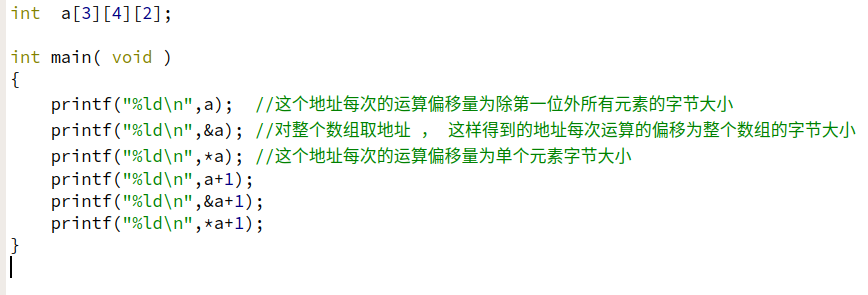
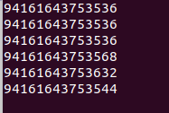

```
#include<stdio.h>
void main()
{
    short *p,*q;
    short arr[15]={0};
    p=q=arr;
    p++;
    printf("%d,",p-q);
    printf("%d,",(char*)p-(char*)q);
    printf("%d",sizeof(arr)/sizeof(*arr));
}
```
指针自增、自减每次移动的偏移量是指针所指向对象的字节大小，所以p++与q的偏移量是2个字节。
指针相减的值是指针地址的偏移除以指针每次移位的大小；
1)p-q=1;偏移量为2个字节，每次移动2个字节，所以为1
2)(char *)p-(char *)q，指针的偏移没变，但是每次指针移位是按照（char\*）类型移动，即每次移动1个字节，所以是2
3）数字每次元素2个字节，所以sizeof(arr)为30，sizeof(*arr)为2。


错误的地方：误认为sizeof返回的是数组的大小，实际上是返回字节数。
除了上面所说的，类型不同的指针不能作减法。


###### 关于C字符串
常量字符数组
char *p=”hello”;p[1]=’E’ ;//这种方式是为定义行为。


###### 关于函数指针

c语言函数指针的定义形式：返回类型 (\*函数指针名称)(参数类型,参数类型,参数类型，…);
c++函数指针的定义形式：返回类型 （类名称::*函数成员名称）（参数类型，参数类型，参数类型，….);    
例如
```
int max(int a,int b)
{
    return a>b?a:b;
}
int main()
{
    int (*pointer)(int,int) = max;
    cout<<pointer(2,3);//通过函数指针调用函数
}

```


#### 关于多维维数组




+ 简单的可以有以下理解
+ a "指向"数组第一维 ，是一个指向int (\*)[4][2] 数组的指针 ，故每次运算的偏移量为sizeof(int)\*2\*4 
+ \*a "指向"数组第二维，是一个指向int (\*)[2] 数组的指针，故每次运算偏移量为sizeof(int)*2
+ 同理，如果来有更多维，可以用继续 **a 方式来获取更低维的地址
+ & a 将地址提升到更高的层面，指向的是整个数组，它作一次加1运算，即偏移到整个数组末尾。


