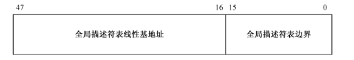

#####平坦模型
+ IA-32架构的处理器是基于分段模型的，因此,32 位处理器依然需要以段为单位访问内存,即使它工作在 32 位模式下。不过,它也提供了一种变通的方案,即,只分一个段,段的基地址是 0x00000000,段的长度(大小)是 4GB。在这种情况下,可以视为不分段,即平坦模型(Flat Mode)，因为有更加高级现代的分页机制，这里的分段只是走个形式。
+ 在平坦模式下,可以执行 4GB 范围内的控制转移,也可以使用 32 位的偏移量访问任何 4GB 范围内的任何位置。
#####GDTR
+ 是一个48位的寄存器，低16位为“全局描述符表边界”，高32位为“全局描述符表线基地址”。
+ “全局描述符表线基地址”，是第一个描述符所在地址
+ “全局描述符表边界” ，是最后一个字节到首个字节的偏移量

理论上：GDT可以放在内存的任何地方，GTDR指到首地址是GDT的首地址。
在进入保护模式前处于实模式，只有1MB的寻址能力，要进入保护模式，需要在1MB内定义GDT。在进入保护模式后可以换个位置重新定义

#####机器开机的过程
+ 1.通电
+ 2.读取rom里面的BIOS，用来检查硬件
+ 3.BIOS 根据指定的顺序，检查引导设备的主引导分区，将bootloader 加载到内存0x7c00处
+ 4.lootloader加载系统内核，将控制权给操作系统
为什么bootloader要加载到0x7c00处？
这是一个历史遗留问题，在8088CPU搭配的操作系统86-DOS，需要的最少内存是32kb，，为了把尽量多的连续内存留给操作系统，主引导分区中的bootloader应当放到内存尾部，一个扇区512字节，bootloader本身会产生数据，栈。额外提供512字节，0x7c00这个位置正好距离0x7fff 1024字节。

#####段描述符
是描述符表中的元素，占8个字节（双字），

+ 可以看见段地址32位不连续，这种格式是从80286扩展出来的，80286也有保护模式，为16位保护模式。
为了保持兼容性，32位从原有格式扩展出来。
+ 20位段界限用来限制扩展范围（偏移量），访问内存的方法是段基地址加上偏移量。
+ G是粒度位，用于解释段界限的含义，为0时段界限以字节为单位，此时段的扩展范围时从1Byte到1Mb，如果是1，以4kb为单位，此时段的扩展范围是4kb到4GB
+ S位是指定描述符的类型。0表示是一个系统段，1表示代码段或者数据段。
+ DPL表示描述符的特权级，用于指定段的特权级，支持4种级别，0，1，2，3。其中0是最高特级，3是最低特权级别。刚进入保护模式时执行的代码具有最高特权级0。为了安全，有些处理器指令只能由0特权级的程序来执行。
