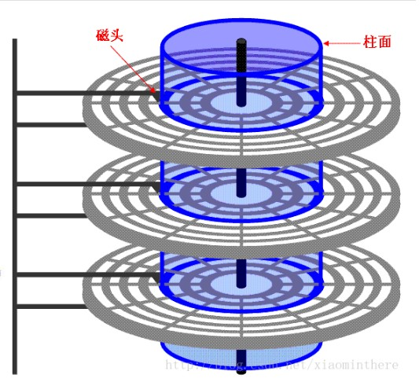

####磁头
磁头是硬盘中对盘片进行读写工作的工具，是硬盘中最精密的部位之一。
####柱面
当磁盘旋转时，磁头若保持在一个位置上，则每个磁头都会在磁盘表面划出一个圆形轨迹就叫磁道。并从外边缘以0开始编号，具有相同编号的磁道形成一个圆柱称之为磁盘的柱面
####扇区
磁盘上的每个磁道被划分为若干个弧段，这写弧段便是磁盘扇区
####硬盘读写
硬盘读写的基本单位是扇区。要读就至少读一个扇区，要写就至少写一个扇区吗，使得主机与硬盘之间的数据交换是成块的，硬盘是典型的块设备。
####CHS寻址模式
+ CHS寻址模式将硬盘划分为柱面（Cylinder），磁头（Heads），扇区（Sector）
+ 知道CHS可以确定磁盘容量
+ 从硬盘中读取数据最原始的方式是CHS模式
#####LBA寻址
+ logical block address
+ 所有扇区统一编址，从0开始一一编号，这种寻址方式称为逻辑扇区寻址