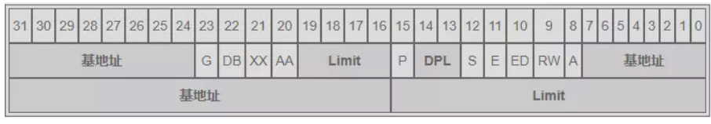

+ 在实模式下，逻辑地址以：”段地址：偏移地址“形式给出。
线性地址的形成是通过段地址左移动4为+偏移地址，最后形成20位地址。
+ 在保护模式下，地址以 “段选择符：偏移地址” 形式给出。
段选择符16位，偏移地址32位。

段选择符中有13位为段描述符表的索引值，索引最大：2^13 ，另外有一位Ti为来指明是全局描述符GDT还是局部描述符（LDT），一共可以表示22^13=16384段，偏移地址32位，一个段最大4GB,这样最大寻址能力4GB16384=64TB
##### 段描述符表
###### 全局描述符表（GDT）
+ 存在的意义：
在整个系统中，全局描述符表GDT只有一张（一个处理器对应一个GDT），GDT可以被放在内存的任何位置，但CPU必须知道GDT的入口，也即基地值存储位值，intel设计者提供了寄存器GDTR用来存放GDT入口地址，可以通过指令**lgdt**（load gdt）将GDT的入口地址装入此寄存器，GDTR中存放的是GDT在内存中的基地值和其表长界限。
+ GDTR
该寄存器一共48位，其中高32位用来存储我们的GDT在内存中的位置，其余的低16位用来存GDT有多少个段描述符
+ GDT可以被放在内存的任何位置，但CPU必须知道GDT的入口。
###### 局部描述符表（LDT）
##### 段描述符

段描述符8字节64位
三块“基地址”组合成32位段起始地址，两块Linit组成该内存分段的长度
